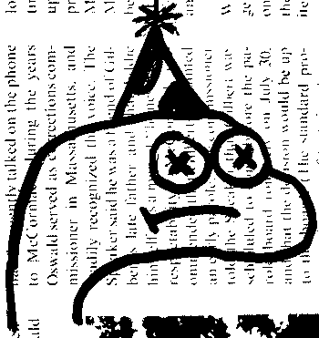

# Kowalski

Born as a slack bot but has grown into a discord bot. I'm cheap so made discord work. I do miss the attachments in messages but I love not having any locked out messages for going past my 10k archive limit.

Anyway, maybe more will come later, but this is extremely tightly coupled with my needs and super brittle. Enjoy!


## Config

You will need to set the following environment variables:

```
DISCORD_TOKEN=
FUNHOUSE_TOKEN=
FUNHOUSE_URL=
SENTRY_URL=
PAYCHECK_CHANNEL_ID=
```

Discord is the API token for your server.

Funhouse is a running instance of [funhouse](https://github.com/dillonchr/funhouse).

Sentry is the raven URL to report errors on sentry.

Paycheck channel id is what channel your debits will take place in.


## Upcoming

I plan to clean up the code here, and try and wrap bunches of tests all over this bad boy. But the spirit is willing, so it goes. Watch this space.

